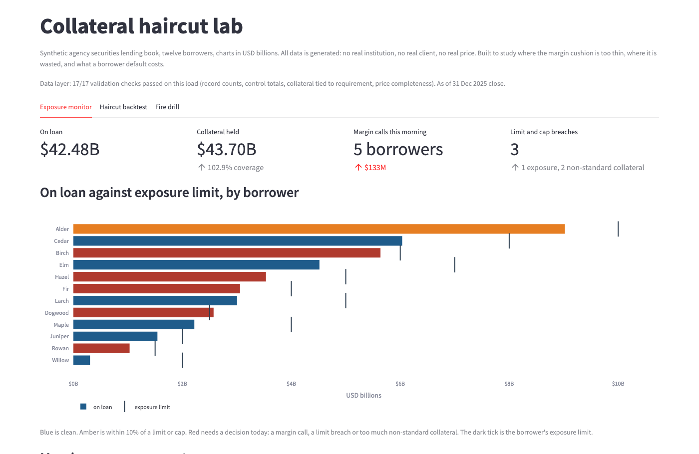

# collateral-haircut-lab

[](https://github.com/nmadagi/collateral-haircut-lab/actions/workflows/ci.yml)

I built this to work out where the margin cushion in a securities
lending book actually sits. Agency lenders take 102% collateral against
cash and 105% against everything else, for every borrower and every
security, whatever the market is doing. That number is a convention. I
wanted to see what happens when you backtest it the way you would
backtest a VaR. It is a synthetic agency lending book: twelve
borrowers, four lent asset classes, five collateral classes, three years
of daily prices with a planted stress episode, marked every day against
the requirement and the limits. On this book the flat schedule is beaten
159 times where 55 would be expected at 99%, red on both equity-versus-
cash pairs and never once on Treasuries. Scaling the haircut to the
volatility of each pair brings the count to 56 and needs $101 million
less collateral. The cushion is in the wrong places, not too small.

All data is synthetic. No real institution, no real client, no real
price.



Live app: https://collateral-haircut-lab.streamlit.app

## Run it

```
pip install -r requirements.txt
streamlit run app.py
```

Tests: `python -m pytest tests/`. Export the tables as CSV:
`python -m data.export`.

## How it hangs together

Prices, borrowers and position-level loans are generated with a fixed
seed and loaded into DuckDB. The load is gated: record counts, on-loan
control totals per borrower, collateral tied to loan times requirement
times buffer, price completeness across every series and every date.
Any failed check blocks the load and names itself. Everything downstream
reads from that layer with SQL.

Three tabs. The exposure monitor marks every position at the as-of
close, rolls it up per borrower against the flat requirement, and
flags the margin calls, the exposure limit breaches and the non-standard
collateral cap breaches for the morning. The haircut backtest puts the
flat schedule next to a volatility-scaled haircut (a 99% two-day move of
the lent basket over the collateral basket from the trailing year,
floored at 101%) for every pair in the book, counts exceedances after
the first year and zones them with the Basel traffic light. The fire
drill defaults one borrower and closes it out, either at today's prices
or over the worst two consecutive days in the history for that
borrower's mix, with netting under one master agreement.

The one AI piece is the senior management summary. The engine computes,
the LLM only phrases: it gets a block of finished figures, and every
number in its reply is checked against that block before display. If it
invents one, the reply is discarded for a deterministic template. No API
key means the template runs alone.

Calibration and every simplification are written up in
[docs/assumptions.md](docs/assumptions.md). Build decisions are in
[notes.md](notes.md).

## Author

Nitin Madagi - [github.com/nmadagi](https://github.com/nmadagi)

MIT license.
